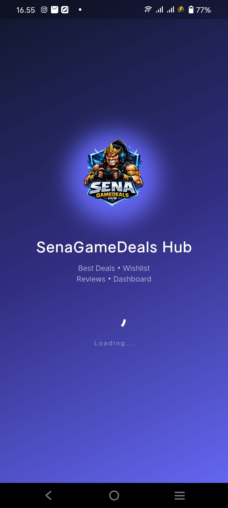
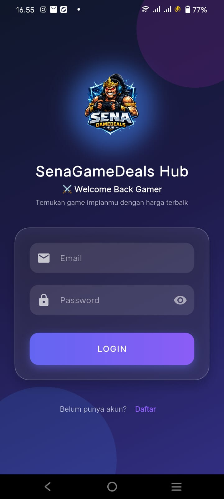
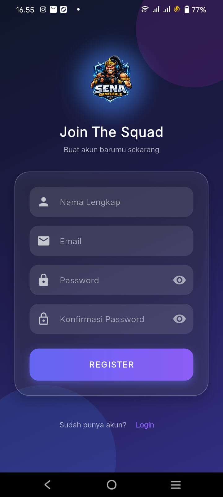
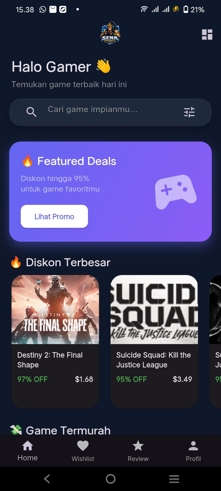

# 🎮 Senagamedeals Hub

Aplikasi mobile berbasis Flutter yang digunakan untuk mencari dan melihat promo game terbaik dari berbagai platform menggunakan CheapShark API. Aplikasi ini juga dilengkapi fitur Login, Register, Wishlist, Review Game, dan Dashboard Statistik yang terhubung dengan Laravel REST API.

---

## 📱 Fitur Utama

- 🔐 Login & Register
- 🎮 Menampilkan daftar game promo
- 🔍 Pencarian game
- ❤️ Wishlist Game
- ⭐ Review dan Rating Game
- 👤 Profil Pengguna
- 🌐 Integrasi REST API Laravel
- 💾 Penyimpanan data menggunakan MySQL

---

## 🛠️ Teknologi yang Digunakan

### Frontend
- Flutter
- Dart

### Backend
- Laravel 10
- REST API

### Database
- MySQL

### API Eksternal
- CheapShark API

---

# 📸 Cuplikan Layar (Screenshots)

## Splash Screen



---

## Login Screen



---

## Register Screen



---

## Home Screen



---

## Wishlist Screen


---

## Review Screen


---

# 📂 Struktur Project

```bash
lib/
│
├── models/
├── screens/
├── services/
├── widgets/
├── main.dart
│
assets/
│
├── images/
│   ├── awal.jpeg
│   ├── login.jpeg
│   ├── register.jpeg
│   ├── 1.jpeg
│   ├── wishlist.jpeg
│   └── review.jpeg
│
pubspec.yaml
```

---

# 🚀 Cara Clone dan Menjalankan Project

### 1. Clone Repository

```bash
git clone https://github.com/garnezabima/senagamedeals_hub.git
```

Masuk ke folder project:

```bash
cd senagamedeals_hub
```

---

### 2. Install Dependency

```bash
flutter pub get
```

---

### 3. Konfigurasi API

Buka file:

```bash
lib/services/api_service.dart
```

Pastikan Base URL mengarah ke server Laravel:

```dart
class ApiService {
  static const String baseUrl =
      "https://pwmhs.web.id/garneza/api";
}
```

---

### 4. Jalankan Aplikasi

```bash
flutter run
```

---

# 🔗 REST API Endpoint

## Authentication

| Method | Endpoint |
|----------|------------|
| POST | /register |
| POST | /login |
| POST | /logout |

### Contoh

```http
POST /api/register
POST /api/login
```

---

## Wishlist

| Method | Endpoint |
|----------|------------|
| GET | /wishlists?user_id=1 |
| GET | /wishlists/{id} |
| POST | /wishlists |
| PUT | /wishlists/{id} |
| DELETE | /wishlists/{id} |

---

## Review

| Method | Endpoint |
|----------|------------|
| GET | /reviews |
| GET | /reviews/{id} |
| POST | /reviews |
| PUT | /reviews/{id} |
| DELETE | /reviews/{id} |

---

# 📊 Database

Database menggunakan MySQL dengan tabel utama:

- users
- wishlists
- reviews
- personal_access_tokens

---

# 👨‍💻 Developer

**Garneza Bima Priambada**  
Teknik Informatika  
Universitas Duta Bangsa Surakarta

---

# 📜 Lisensi

Project ini dibuat untuk keperluan pembelajaran dan tugas UAS Mobile Programming.
